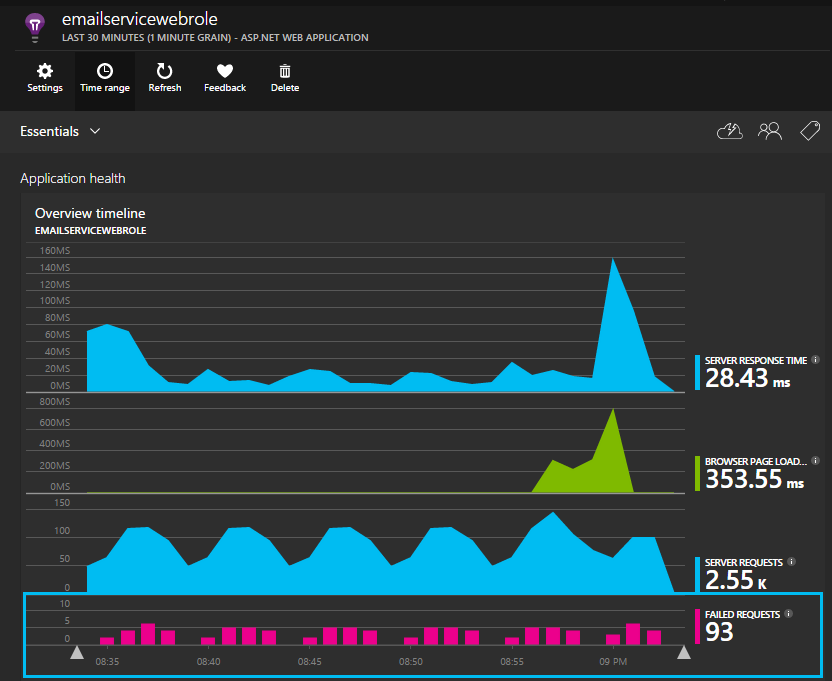

##ApplicationInsights: Web role

**NOTE:** The purpose of this sample is to illustrate how an existing cloud service can be instrumented to report AI telemetry. 
Please see the [original code sample](https://code.msdn.microsoft.com/windowsapps/Windows-Azure-Multi-Tier-eadceb36) or [Azure documentation](http://azure.microsoft.com/en-us/services/cloud-services/) for information on cloud services in general.
The only changes to the original code, pertain to the lines of code/configuration related to Application Insights telemetry.

This sample web role is instrumented with the [Application Insights for Web] (http://www.nuget.org/packages/Microsoft.ApplicationInsights.Web) nuget and reports the following telemetry:

* **Request**
  * Collected out of the box with the [Application Insights for web nuget](http://www.nuget.org/packages/Microsoft.ApplicationInsights.Web)
  * A request is considered failed if the response has a statusCode >= 400. If that does not work for you (401s are not failures for instance), you can override the default behavior:
    * Provide a custom implementation of the ITelemetryInitializer interface - as shown [here](Telemetry/MyTelemetryInitializer.cs)
	* Add this to the list of TelemetryInitializers in ApplicationInsights.config as shown [here](ApplicationInsights.config#L56)
  * Requests are groupable by the "Request Name" attribute, which allows us to provide meaningful aggregations on the number of calls, response times, failures etc. The default naming scheme is the following:
    * ASP.NET MVC: Request name is set to “VERB controller/action”.
	* ASP.NET MVC Web API: Per above both requests “/api/movies/” and “/api/movies/5” will be result in “GET movies”. To support Web API better, request name includes the list of all names of routing parameters if “action” parameter wasn’t found. In this case, the requests will be reported as “GET movies” and “GET movies[id]”.
    * If routing table is empty or doesn’t have “controller” - HttpRequest.Path will be used as a request name. This property doesn’t include domain name and query string.
    * NOTE: Request names are case-sensitive. If the default rules do not work for your application (each request gets a unique name for instance) - you could provide a custom WebOperationNameTelemetryInitializer implementation to override default behavior.
	

* **Dependency**
  * This web role is set up with the [Application Insights Agent](http://azure.microsoft.com/en-us/documentation/articles/app-insights-monitor-performance-live-website-now/) AKA "Status Monitor"
  * In addition to collecting SYNC/ASYNC dependency calls, using the AI Agent also gets you additional information such as SQL statements
  * To use the AI Agent with your web roles:
    * Add the [AppInsightsAgent](AppInsightsAgent) folder and the 2 files in it to your web/worker role projects. Be sure to set them up to be copied always into the output directory
	* Add the start up task to the CSDEF file as shown [here](../AzureEmailService/ServiceDefinition.csdef#L18)
	* NOTE: *Worker roles* require 3 environment variables as shown [here](../AzureEmailService/ServiceDefinition.csdef#L44). This is not required for web roles

* **Exception**
  * This web role has MVC5 and Web API 2 controllers. The unhandled exceptions from the 2 are captured with the following:
    * [AiHandleErrorAttribute](Telemetry/AiHandleErrorAttribute.cs) set up [here](App_Start/FilterConfig.cs#L12) for MVC5 controllers
	* [AiWebApiExceptionLogger](Telemetry/AiWebApiExceptionLogger.cs) set up [here](App_Start/WebApiConfig.cs#L25) for Web API 2 controllers
	* See [this article](http://azure.microsoft.com/en-us/documentation/articles/app-insights-asp-net-exceptions/), for information on how you can collect unhandled exceptions from other application types 

* **Page Views**
  * Collected automatically by adding the [JavaScript nuget](http://www.nuget.org/packages/Microsoft.ApplicationInsights.JavaScript)
  * You could also just add a JavaScript snippet to shared "master" file as shown [here](Views/Shared/_Layout.cshtml#L9)
  * See [JavaScript SDK](https://azure.microsoft.com/en-us/documentation/articles/app-insights-web-track-usage/) for more information on custom usage telemetry you could collect

* **Traces**
  * This web role uses System.Diagnostics traces. They are automatically collected with the [TraceListener](http://www.nuget.org/packages/Microsoft.ApplicationInsights.TraceListener) nuget added
  * NLog, log4Net etc. also supported. See this [article](http://azure.microsoft.com/en-us/documentation/articles/app-insights-search-diagnostic-logs/) for more information on collecting traces from your worker roles
  * If you trace exceptions, the rich detail with exceptions will automatically be collected

* **Performance Counters**
  * The following counters are collected by default:
    * \Process(??APP_WIN32_PROC??)\% Processor Time
	* \Memory\Available Bytes
	* \.NET CLR Exceptions(??APP_CLR_PROC??)\# of Exceps Thrown / sec
	* \Process(??APP_WIN32_PROC??)\Private Bytes
	* \Process(??APP_WIN32_PROC??)\IO Data Bytes/sec
	* \Processor(_Total)\% Processor Time
	* \ASP.NET Applications(??APP_W3SVC_PROC??)\Requests/Sec	
	* \ASP.NET Applications(??APP_W3SVC_PROC??)\Request Execution Time
	* \ASP.NET Applications(??APP_W3SVC_PROC??)\Requests In Application Queue
  * You can specify additional custom or other windows performance counters as shown [here](ApplicationInsights.config#L22)

**Environment support:** To collect AI telemetry from multiple environments (DEV/INT/Pre-Prod/PROD etc): 
* Set the Instrumentation key in the respective CSCFG files
* Configure it at application start up time, in the global.asax.cs file for web roles as shown [here](Global.asax.cs#L27)
* The JavaScript can also read from the same as shown [here](Views/Shared/_Layout.cshtml#L9). 
  * Note that this has a slight performance overhead, but is helpful if you are looking to report both client and server side telemetry to the same instrumentation key

###Important
* If user/session telemetry is not applicable for your web/worker role, we recommend you remove the following telemetry modules and initializers from the ApplicationInsights.config file
  * [WebSessionTrackingTelemetryModule](ApplicationInsights.config#L9)
  * [WebUserTrackingTelemetryModule](ApplicationInsights.config#L10)
  * [WebSessionTelemetryInitializer](ApplicationInsights.config#L63)
  * [WebUserTelemetryInitializer](ApplicationInsights.config#L62)
* If your web/worker role has a mix of browser based clients & others, and you do have your web clients instrumented with the [JavaScript nuget](http://www.nuget.org/packages/Microsoft.ApplicationInsights.JavaScript):
  * Add SetCookie = false to the [WebSessionTrackingTelemetryModule](ApplicationInsights.config#L9) and [WebUserTrackingTelemetryModule](ApplicationInsights.config#L10) as mentioned [here](ApplicationInsights.config#L17)
