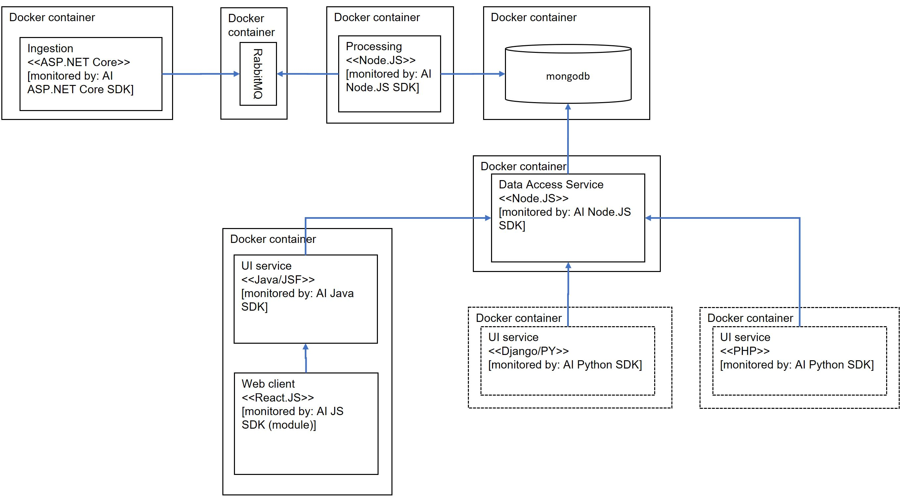

## What is Mistral?

Mistral is a canonical app that showcases how Application Insights can be used on microservices built with popular open source technologies for Linux platform and deployed via Docker.

## Requirements
### P1s
* [P1] Monitor calls made to popular open source storage technology (examples: MongoDB, MySQL)
* [P1] Propagating context via asynchronous transactions spanning multiple services written on different technologies
* [P1] Showcasing Application Insights Java SDK
* [P1] Showcasing Application Insights Node.JS SDK

### P2s
* [P2] Showcasing queue monitoring, i.e. metrics around queue throughput, item in queue duration
* [P2] Showcasing Application Insights SDK for DJango
* [P2] Showcasing ApplicationInsights SDK for PHP


## Proposed architecture   
The diagram below demonstrates the proposed architecture. 


## Repo structure
* [/src/da](./src/da) - Data Access Service. Docker image: `microsoft/sample-mistral:da`
* [/src/mongo](./src/mongo) - Mongo storage. Docker image: `mongo`
* [/src/mongo/dbinit/test](./src/mongo/dbinit/test) - DB test. Docker image: `microsoft/sample-mistral:dbinit-test`
* [/src/maestro](./src/maestro) - Ingestion service. Docker image `microsoft/sample-mistral:mistral-maestro`
* _(Doesn't exist)_ [/src/pr](./src/pr) - Processing service. Docker image `microsoft/sample-mistral:pr`
* _(Doesn't exist)_ [/src/fe-java](./src/fe-java) - FE Java service. Docker image `microsoft/sample-mistral:fe-java`
* _(Doesn't exist)_ [/src/fe-python](./src/fe-python) - FE Python service. Docker image `microsoft/sample-mistral:fe-python`
* _(Doesn't exist)_ [/src/fe-php](./src/fe-php) - FE PHP service. Docker image `microsoft/sample-mistral:fe-php`

## Deploy to ACS with Kubernetes
_<span style="background-color:orange;">
TODO: need to merge these into a single bash script
<span>_

* [Install Azure CLI](https://docs.microsoft.com/en-us/cli/azure/install-azure-cli)
* Create Azure resource group:
```
RESOURCE_GROUP=mistral
LOCATION=westus
az group create --name=$RESOURCE_GROUP --location=$LOCATION
```
* Create Kubernetes cluster
```
DNS_PREFIX=mistral
CLUSTER_NAME=mistral-cluster
az acs create --orchestrator-type=kubernetes --resource-group $RESOURCE_GROUP --name=$CLUSTER_NAME --dns-prefix=$DNS_PREFIX --generate-ssh-keys
```

* Connect to cluster and list nodes
```
az acs kubernetes install-cli
az acs kubernetes get-credentials --resource-group=$RESOURCE_GROUP --name=$CLUSTER_NAME
kubectl get nodes
```

* Start da image and expose to the world
```
kubectl run da --image microsoft/sample-mistral:da
kubectl expose deployments da --port=80 --target-port=8080 --type=LoadBalancer
```

* After waiting for exposure to propage you can get external IP to da from ```kubectl get svc```


## Next steps
* Complete ACS steps to deploy mongo to ACS and link to da
* Publish `mistral-da` and `mistral-dbinit-test` images to Microsoft image repository
* Create container cluster using Kubernetes and publish to Azure using Azure Container Service
    * Now we have official instance of `mistral` running in Azure
* `da` next steps
    * Enable raw data endpoint
    * Enable metric data endpoint
* Create Data generator and purger
* Create PHP FE
* Create Python FE
* Create View generator. Look into: [Selenium on Docker](https://github.com/SeleniumHQ/docker-selenium)
* Enable Application Insights for Docker running in a separate container


